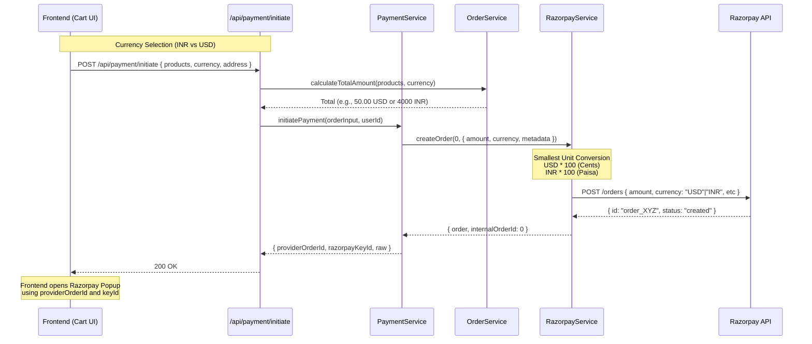

# Payment Integration Workflow (Razorpay)

This document outlines the end-to-end workflow for initiating and processing payments using Razorpay, supporting both **INR** and **USD** currencies.

## 1. Request/Response Schemas

### Input Schema (`PaymentInitiateRequest`)
Location: `src/schema/payment.schema.ts`

| Field | Type | Required | Description |
|-------|------|----------|-------------|
| `userId` | `number` | Yes | Internal user ID |
| `paymentMethod` | `"razorpay"` | Yes | Fixed as razorpay |
| `totalAmount` | `number` | Optional | Computed server-side if omitted |
| `totalAmountCurrency` | `"inr" \| "usd"` | Yes | Determines the billing currency |
| `products`| `Array<{productId, quantity}>` | Yes | List of items to purchase |
| `billingAddress` | `AddressInput` | Yes | Structure below |
| `shippingAddress`| `AddressInput` | Yes | Structure below |

**Address Input:**
- `streetAddress1`: `string`
- `streetAddress2`: `string` (Optional)
- `city`: `string`
- `state`: `string`
- `postalCode`: `string`
- `country`: `string`

### Output Schema (`PaymentIntentResult`)
Location: `src/schema/payment.schema.ts`

| Field | Type | Description |
|-------|------|-------------|
| `provider` | `"razorpay"` | Targeted provider |
| `providerOrderId` | `string` | The ID generated by Razorpay (e.g., `order_PQr...`) |
| `razorpayKeyId` | `string` | Public Key ID for frontend SDK |
| `raw` | `object` | Contains the full Razorpay order object |

---

## 2. Sequence Diagram



---

## 3. Implementation Logic

### Currency Handling
The system dynamically routes the currency based on `totalAmountCurrency`:

- **USD Logic**: 
    - `OrderService` fetches prices from `products_price` where `currency_type = 'usd'`.
    - `RazorpayService` converts dollars to cents (`amount * 100`).
    - Razorpay API is called with `currency: "USD"`.
- **INR Logic**: 
    - `OrderService` fetches prices from `products_price` where `currency_type = 'inr'`.
    - `RazorpayService` converts rupees to paisa (`amount * 100`).
    - Razorpay API is called with `currency: "INR"`.

### Smallest Unit Conversion
Razorpay requires the amount in the smallest denominator.
```typescript
// From src/modules/payment/razorpay.service.ts
const currency = (opts?.metadata?.currency as string) || "INR";
const totalAmountInSmallestUnit = opts?.metadata?.amount
  ? Math.round(Number(opts.metadata.amount) * 100)
  : 0;
```

### Address Validation
Addresses are passed through to the metadata or used during the creation of the final internal order after the webhook confirmation.
- **Shipping**: Used for tax and fulfillment.
- **Billing**: Required for international (USD) payment verification.
