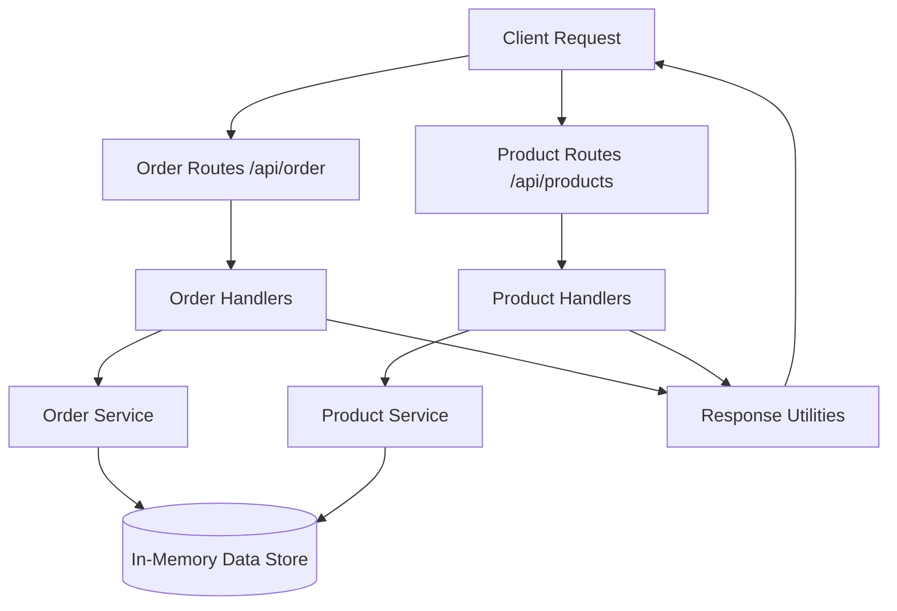
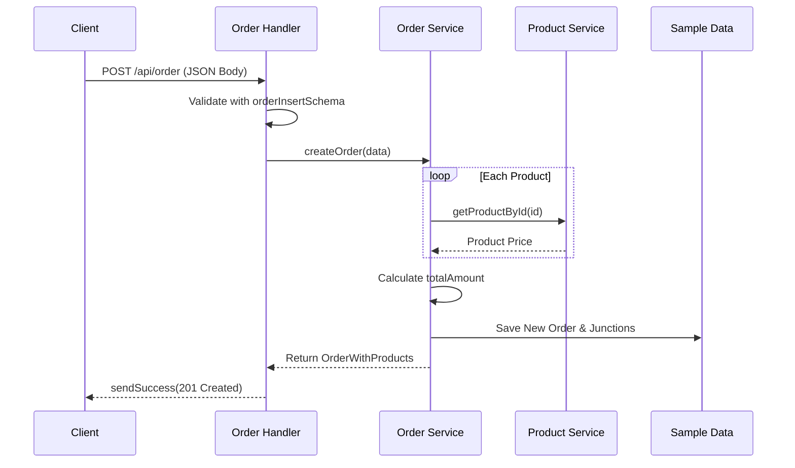
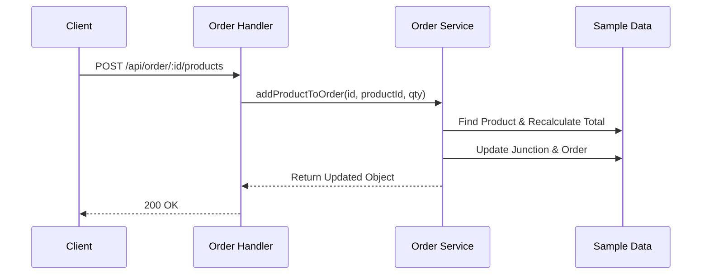
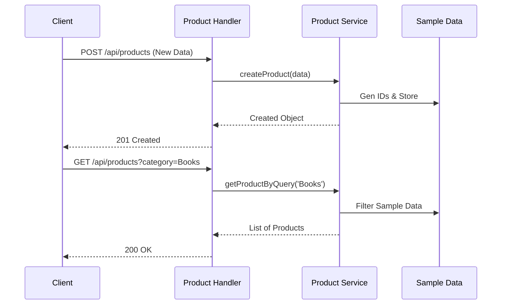
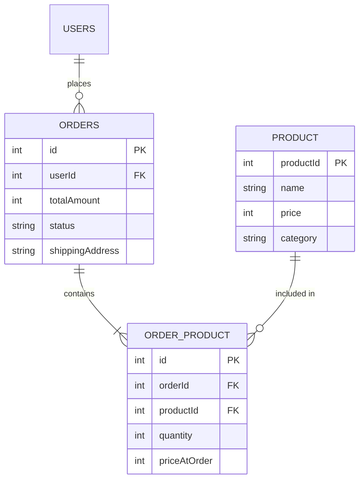

# System Workflows

This document visualizes the architecture and flows for the Order and Product management systems in our Fastify application.

## Core Architecture

Both systems follow a consistent layered architecture:

- **Routes**: Unified endpoint definitions and Zod validation.
- **Handlers**: Typed request processing and standardized responses.
- **Service**: Business logic and in-memory data management.
- **Schema**: Shared types and validation rules.

## Order System Flow

### 1. Create Order Flow

When a user submits a checkout request.

### 2. Modifying Order Contents

Adding/Removing products affects the total amount.

## Product System Flow

### 1. Product Management (CRUD)

Standard lifecycle of product items.

## Data Schema Relationships

